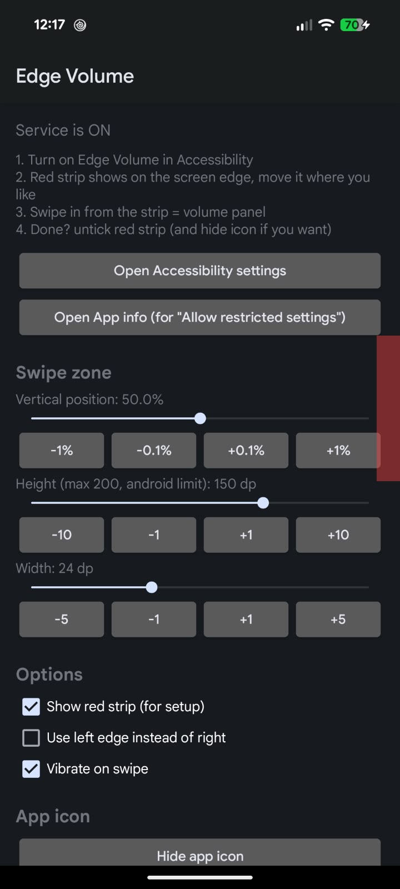

<p align="center">
  
</p>

<h1 align="center">Edge Action</h1>

<p align="center">
  Swipe in from your screen edge to run an action. Volume panel, open an app, flashlight, media keys and more.<br>
  Your back gesture still works everywhere else. <b>No root needed.</b>
</p>

> Renamed from **Edge Volume**. The package is `com.sudoflash01.edgeaction`, so Android treats it as a new app: uninstall the old Edge Volume, then turn the Accessibility service on again for Edge Action.

<p align="center">
  
  
  
</p>
<p align="center">
  
  
  
</p>

## What's new in v2.0

Big update, so it gets a new major version. Edge Volume (v1) had one strip and one job (volume). Edge Action is much more:

- **Multiple strips** on the left and right edges, each with its own colour, name, action and on/off switch
- **Lots of actions**: volume panel (any stream), open app, open link, custom intent, flashlight, media keys, system actions (Back, Home, Recents, Power menu, Screenshot...)
- **Swipe up / down along a strip** to show the volume panel or slide the volume
- **New Material 3 design** with Home and Settings tabs, a strip editor, light / dark theme and optional dynamic colour
- **New logo** with a themed icon on Android 13+
- Renamed from Edge Volume to **Edge Action**

## Why I made this (the honest reason)

I love my Pixel. I do not want its volume button to break. Pressing that button again and again every day felt like slowly killing it, and I didn't like that, lol. So now I just swipe on the screen edge and the button gets to live a long happy life.

Every edge swipe = Back with gesture navigation, so I carved out a tiny strip just for volume. Then it grew into a few more things you can put on a strip.

## Who is this useful for

- People who want to **save their volume buttons** from wearing out (hi, me)
- People whose **volume button is already broken** or stuck, this gives you a working volume control with no repair needed
- People who find the buttons hard to reach, or use the phone one handed
- Anyone who just likes edge gestures

---

## What it does

- Puts small strips on the **left and right edges**, as many as fit. Each one has its own colour, name and on/off switch
- Swipe **inward** from a strip = that strip's action (volume panel by default)
- Optional: swipe **up or down along** a strip = show the volume panel, or **slide to change the volume**
- Back gesture is turned off **only inside the strip**, everywhere else on the edge it works like normal
- You choose where each strip is: edge, vertical position, height and width
- A **coloured preview** shows where the strip is while you set it up (hide it when done, the strip keeps working)
- Can **hide the app icon** from inside the app (no root, no adb)
- **Material 3** look with light and dark themes, optional **dynamic colour** (wallpaper colours) on Android 12+, and a **themed icon** on Android 13+

### Actions a swipe can run

| Type | Options |
|---|---|
| Volume | Show the volume panel for Media, Ring, Alarm, Notification, Call or System |
| Apps and links | Open an app (picker), open a web link |
| Custom intent | Start an activity, start a service or send a broadcast from an `intent:#Intent;...;end` URI |
| Flashlight | On / off |
| Media | Play / pause, next track, previous track |
| System | Back, Home, Recent apps, Notifications, Quick settings, Power menu, Lock screen, Screenshot |

**Custom intent example** (opens your default camera app):
`intent:#Intent;action=android.media.action.STILL_IMAGE_CAMERA;end`

Opening apps and starting services from a strip works because the strip is a visible window. If a ROM blocks background starts anyway, you'll see a short toast with the error.

### Sliding the volume

Pick **Slide to change volume** under *Swipe up / down*. Start on the strip and move your finger up (louder) or down (quieter). About 260 dp of travel covers the whole range, and your finger can leave the strip while sliding.

## Why it's light on battery and RAM

- No background loop, no timers, no polling
- No foreground service, so **no notification**
- Doesn't listen to any accessibility events
- Each strip is just one tiny window, and it only does something when you touch it
- Release build has minify + resource shrinking on

I haven't put exact numbers here because they depend on your phone. You can check yourself:

```
adb shell dumpsys meminfo com.sudoflash01.edgeaction | head -25
```

Look at the TOTAL PSS line.

## Privacy

- **No internet permission.** The app can't send anything anywhere
- It's an accessibility service, but it has **no access to your screen content** and doesn't subscribe to any events. It only exists to place the strip windows
- No ads, no analytics, nothing stored except your strip settings on the phone

---

## Requirements

- Android **10 or newer**
- **Gesture navigation** turned on (if you use 3-button nav you don't need this app anyway)

## Install

1. Download the APK from the [Releases](../../releases) page
2. Install it and **open it once** (some phones won't let you enable the service if the app was never opened)
3. Follow the setup below

## Setup

1. Open the app. If it says **Edge Action is off**, tap **Turn on** and enable **Edge Action** in Accessibility
2. Tap **Add strip** (or tap an existing strip). A coloured preview shows on the edge. Move it with the sliders and the +/- buttons until it's where you like
3. Pick what **Swipe in** does, then swipe inward from the strip
4. Happy? Use **Hide previews** on Home (or turn off **Show on screen** in the strip editor). Done

### Toggle greyed out / "Restricted setting" message?

Android 13+ blocks accessibility for apps not installed from the Play Store.

1. Try turning the service on once (it will show the restricted message, press OK)
2. Go to **Settings > Apps > Edge Action**
3. Tap the **3 dot menu** (top right) > **Allow restricted settings**
4. Go back to Accessibility and turn it on

The app has an **Open App info** button (Settings tab > Restricted settings) that takes you straight to step 2. The 3 dot menu only shows up after you've tried step 1, that's an Android thing, not a bug.

Rooted? You can skip the menu with:

```
su -c "cmd appops set com.sudoflash01.edgeaction ACCESS_RESTRICTED_SETTINGS allow"
```

---

## The screens

| Screen | What is on it |
|---|---|
| **Home** | Service on/off status, how much of each edge's 200 dp is used, the list of strips (tap to edit, switch to turn on/off), **Add strip** button, and **Show previews / Hide previews** |
| **Strip editor** | Name and on/off. **Gestures**: swipe-in action, swipe up/down mode, volume type. **Position and size**: edge, vertical position, height, width (sliders with fine +/- buttons). **Appearance**: colour and preview on/off. Delete is in the top bar |
| **Settings** | Dynamic colour, open Accessibility, restricted-settings help, vibrate on swipe, hide app icon, short how-to, about the developer and a link to star the project |

### Size limits

| Size | Value |
|---|---|
| Height | 40 dp up to the free space on that edge (max 200 dp) |
| Width | 4 to 60 dp. Thin = fewer accidental swipes, but harder to hit |

### Strips never overlap

Android only gives apps about **200 dp of back-gesture exclusion per edge in total**, so all strips on one edge **share** 200 dp. It is not 200 dp per strip: one 135 dp strip on the right leaves 65 dp for any other strip on the right. The editor shows how much is left and the height slider stops at that limit.

Edges are left and right only: the top and bottom edges belong to the system (notification shade and home gesture) and Android doesn't let apps carve those out.

## Hiding the icon

Open the **Settings** tab and turn on **Hide app icon**. The service keeps running.

To open the app again later: **Settings > Accessibility > Edge Action > Settings** (the gear/settings row on that page). You can also bring the icon back from there with **Show app icon**.

---

## Troubleshooting

**Nothing happens when I swipe**
- Is the service actually on? Open the app, the top card says **Edge Action is on** or **off**
- Make sure the strip is switched on, and turn its preview on to check it's where you expect
- Start the swipe from inside the strip, not just near it
- Swipe **inward** (toward the middle of the screen), not along the edge

**Back still fires inside the strip**
- Make the strip a bit wider, some phones have a wide back-gesture area
- Start the swipe a little inside the strip, not on the very last pixel
- Some ROMs ignore the exclusion rule from apps. If yours does, open an issue with your phone model + Android version

**Service turned itself off**
- Installing or updating the app can turn it off. Just toggle it on again
- Don't **Force stop** the app, Android disables the service when you do. Swiping it away from recents is fine
- Set the app's battery to **Unrestricted** (Settings > Apps > Edge Action > App battery usage). Some phones (Xiaomi, Oppo, Vivo, Realme, Samsung, etc) kill background stuff aggressively, you might also need to allow autostart

**Volume panel shows but it's the wrong volume**
- Open the strip, go to **Gestures** and choose the volume type you want (Media is the default)

**Add strip says "No room left"**
- That edge's 200 dp is used up. Shrink another strip, or put the new one on the other edge

---

## Known limits

- Max zone height is about 200 dp per edge, that's an Android rule, not mine
- Needs gesture navigation
- Phones with their own custom gesture system might not respect the exclusion
- Left and right edges only (top and bottom are owned by the system)
- All strips on one edge share Android's ~200 dp exclusion limit

## How it works (short version)

1. The accessibility service adds a tiny overlay window on the screen edge for each strip
2. Those windows tell Android "don't treat touches here as Back" using `setSystemGestureExclusionRects`
3. A touch listener checks if you swiped inward more than about 28 dp (or up/down more than about 14 dp, if you turned that on)
4. If yes, it runs that strip's action. For volume that's `AudioManager.adjustStreamVolume(..., ADJUST_SAME, FLAG_SHOW_UI)`, which shows the panel without changing the volume

One gotcha I hit: the strip view must actually draw something (even an almost invisible color), otherwise Android silently ignores the exclusion zone. That's why a hidden strip still has a 1-alpha background.

## Build it yourself

1. Open the project in Android Studio and let Gradle sync
2. **Build > Build APK(s)** for a quick debug build

For a signed release, make a `keystore.properties` file in the project root:

```
storeFile=/path/to/my.jks
storePassword=your_password
keyAlias=your_alias
keyPassword=your_key_password
```

Then run `./gradlew assembleRelease`. If there's no `gradlew`, run `gradle wrapper` once.

Want your own package name? Change `applicationId` (and `namespace`) in `app/build.gradle.kts`.

Project layout:

```
app/src/main/java/com/sudoflash01/edgeaction/
  EdgeService.kt        the strip windows, swipe detection, running actions
  MainActivity.kt       Home + Settings tabs (bottom navigation)
  StripEditActivity.kt  one strip: gestures, position and size, appearance
  BaseActivity.kt       picks dynamic colour or the default colour set, shows the help sheet
  Strips.kt             strip model, saving, overlap / 200 dp rules, colours
  Actions.kt            list of actions and their names
  Anim.kt               small icon / row animations
  Cfg.kt                setting keys and defaults (old single-strip keys are migrated)
```

Icons are Material icons as vector drawables, tinted from the theme, so they follow light / dark and dynamic colour.

## Tested on

- Google Pixel 8 (Android 14+)
- add yours here, PRs welcome

## Contributing

Issues and PRs are welcome. If something doesn't work on your phone, please include:
- phone model
- Android version / ROM
- what happened vs what you expected

Ideas I might add: separate actions for swipe up and swipe down, long-press actions.

If Edge Action saved your volume button, a star on GitHub helps a lot.

## License

GPL-3.0. See the [LICENSE](LICENSE) file.
